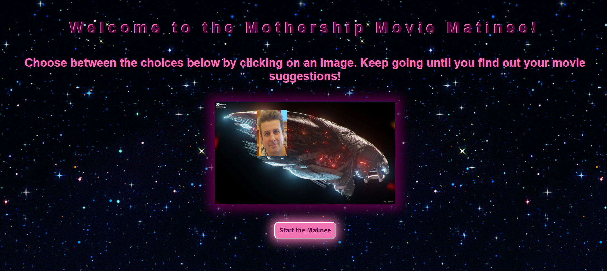
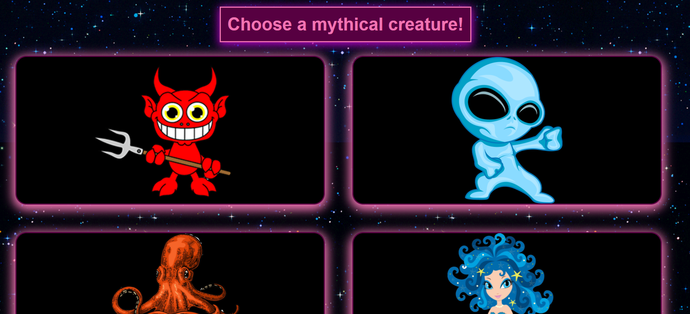
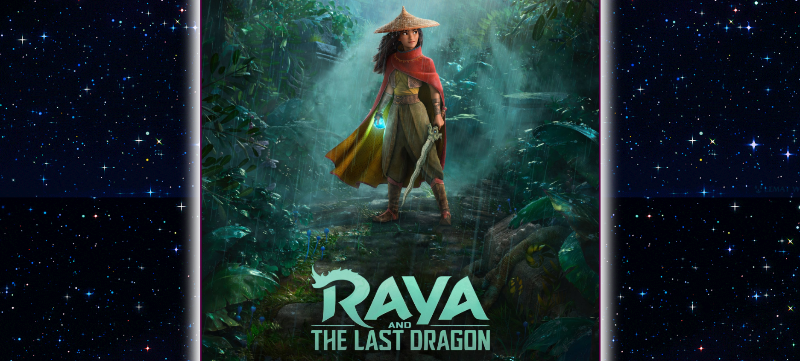

Finished group project for week 7: API Web Application.

Name: Mothership_Movie_Matinee 

The objective of this project was to create a web application from scratch to solved a real world problem by utilizing data that is received from multiple server-side API requests.

Our web application was designed to provide users help choosing a movie to watch but don't know where to begin with the thousands of choices available. Once the website is loaded the user will click on the start button that will load a short three question quiz.  The user will have to click on one of the images available in each question to progress through the quiz. Each image in each question is assigned a specific point value to a certain genre. Each genre is given a range of points.  At the end of the quiz, the point values will be totaled and whatever genre range the points amount to, a movie poster and short summary of the movie from that genre will be displayed on screen and the user MUST watch that movie or be taken by the Mothership.

The API database that we used to pull movies from is The Movie Database API (https://www.themoviedb.org)

Live URL:

https://minionsofthemothership.github.io/random_movie_selector/

Github URL:

https://github.com/MinionsOfTheMothership/random_movie_selector

Screenshots:

